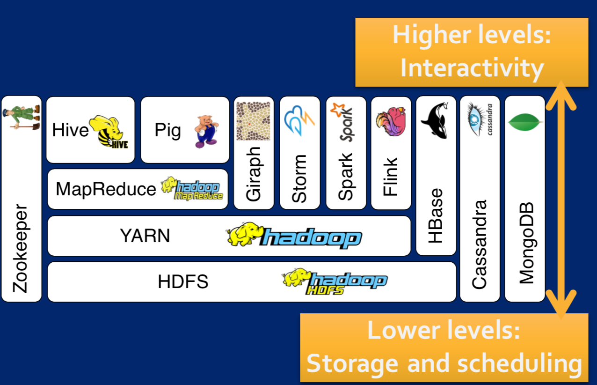

# Big Data Specialization
------

**About this Specialization** Drive better business decisions with an overview of how big data is organized, analyzed, and interpreted. Apply your insights to real-world problems and questions.

Do you need to understand big data and how it will impact your business? This Specialization is for you. You will gain an understanding of what insights big data can provide through hands-on experience with the tools and systems used by big data scientists and engineers. Previous programming experience is not required! You will be guided through the basics of using Hadoop with MapReduce, Spark, Pig and Hive. By following along with provided code, you will experience how one can perform predictive modeling and leverage graph analytics to model problems. This specialization will prepare you to ask the right questions about data, communicate effectively with data scientists, and do basic exploration of large, complex datasets. In the final Capstone Project, developed in partnership with data software company Splunk, you’ll apply the skills you learned to do basic analyses of big data.

# Introduction to Big Data

## About this Course

Interested in increasing your knowledge of the Big Data landscape?  This course is for those new to data science and interested in understanding why the Big Data Era has come to be.  It is for those who want to become conversant with the terminology and the core concepts behind big data problems, applications, and systems.  It is for those who want to start thinking about how Big Data might be useful in their business or career.  It provides an introduction to one of the most common frameworks, Hadoop, that has made big data analysis easier and more accessible -- increasing the potential for data to transform our world!

At the end of this course, you will be able to:

- Describe the Big Data landscape including examples of real world big data problems including the three key sources of Big Data: people, organizations, and sensors. 

- Explain the V’s of Big Data (volume, velocity, variety, veracity, valence, and value) and why each impacts data collection, monitoring, storage, analysis and reporting.

- Get value out of Big Data by using a 5-step process to structure your analysis. 

- Identify what are and what are not big data problems and be able to recast big data problems as data science questions.

- Provide an explanation of the architectural components and programming models used for scalable big data analysis.

- Summarize the features and value of core Hadoop stack components including the YARN resource and job management system, the HDFS file system and the MapReduce programming model.

- Install and run a program using Hadoop!

This course is for those new to data science.  No prior programming experience is needed, although the ability to install applications and utilize a virtual machine is necessary to complete the hands-on assignments.  

Hardware Requirements:
(A) Quad Core Processor (VT-x or AMD-V support recommended), 64-bit; (B) 8 GB RAM; (C) 20 GB disk free. How to find your hardware information: (Windows): Open System by clicking the Start button, right-clicking Computer, and then clicking Properties; (Mac): Open Overview by clicking on the Apple menu and clicking “About This Mac.” Most computers with 8 GB RAM purchased in the last 3 years will meet the minimum requirements.You will need a high speed internet connection because you will be downloading files up to 4 Gb in size.  

Software Requirements:
This course relies on several open-source software tools, including Apache Hadoop. All required software can be downloaded and installed free of charge. Software requirements include: Windows 7+, Mac OS X 10.10+, Ubuntu 14.04+ or CentOS 6+ VirtualBox 5+.

# Resources
- [Course Resouces](./resources)

# My Course One Notes

## Overview

1. What started the big data era
2. Three main big data sources
3. How to get value from big data
4. Big data's characteristics
5. 5 steps to process to gain value from big data 
6. The main elements of the Hadoop stack

## What started the big data era

**Data Torrent + Computing(Anytime and Anywhere)**

## Three main big data sources

- Machines
- People
- Origanization

## How to get value from big data

Value come from integrating different types of data sources

### Data intergation

1. Reduce data complexity
2. Increase data availability
3. Unify your data system

## Big data's characteristics

1. Volume (Size)
2. Varity (Complexity)
3. Valence (Connectedness)
4. Veracity (Quality)
5. Velocity (Speed)

## 5 steps to process to gain value from big data 

1. Acquire
- Indentify data sets
- Retrieve data
- Query data
2. Prepare
Explore data 
- Understand the nature of data 
- Preliminary analysis
Pre-process Data
- clean
- Integrate
- Package
3. Analyze
- Select analytical techiques
- Build models
4. Report
- Communicate results
5. Act
- Apply results

## The main elements of the Hadoop stack

1. Enable Scalability
2. Handle Fault Tolerance
3. Optimized for a Variety Data Types
4. Facilitate a Shared Environnment
5. Provide Value